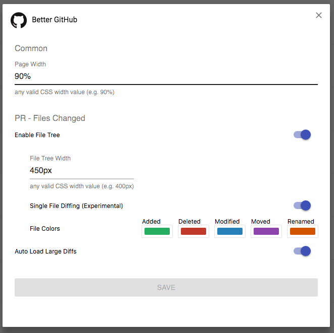

# Better GitHub

Chrome extension that enhances the GitHub experience. Fork of Tal Bereznitskey's [Github PR Tree](https://github.com/berzniz/github_pr_tree)

## Features

- Configurable page width
- Optional PR File Tree
- Optional Single File Diffing (experimental)
- Optional auto-loading of large diffs
- Adds a link to the PR header to jump to the bottom of the page where the merge button and PR status is.

## Screenshots




## Build

1. Install:
	```bash
	yarn install
	```

2. Build:
	```bash
	yarn build
	```
	
	...or for hosted GitHub:
	
	```bash
	yarn build --match=host_pattern
	```
	
	host_pattern must follow pattern rule described here: https://developer.chrome.com/apps/match_patterns
	Example: `*://*.github.mycompany.com/*`
	
3. Package: 
	```bash
	yarn crx
	```


## Install to Chrome
Drag the generated `.crx` file in `crx` directory into the Chrome Extension page.

## Development

1. Install:
    ```bash
    $ yarn install
    ```

2. Run
    ```bash
    $ yarn start
    ```

3. Make changes

4. Click "Reload" on Chrome's "Manage Extensions" tab
